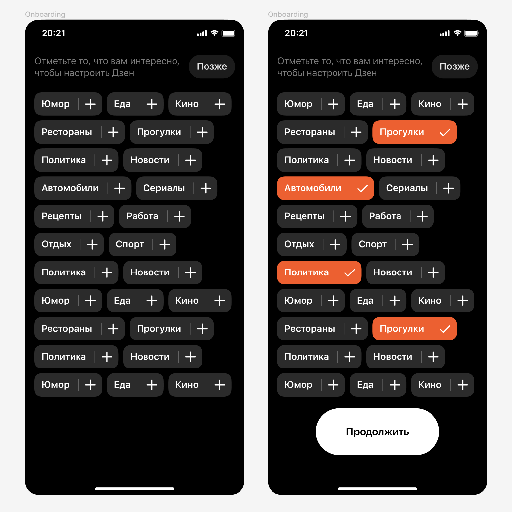

<h1>VKCup-IOS-2022-Qualification</h1>

<h2>Задание</h2>

Мобильное приложение Дзена показывает пользователям ленту самых интересных постов. Впервые заходящим в приложение юзерам мы показываем выбор из множества категорий, которые могут ему понравиться. Разработайте экран выбора интересных категорий.

Ниже представлен макет базовой версии такого экрана. Разработайте один экран мобильного приложения, на котором пользователь сможет выбрать интересные тематики. Для решения этого задания используйте Swift или Objective-C.

Для оценки вашего приложения будем использовать следующие критерии:

<li> Работоспособность. Пользователь должен иметь возможность выбрать подходящие категории.</li>
<li> Анимации. Поддержите анимации выбора категорий, плавное исчезновение выбранных категорий с появлением новых или другой интерактив.</li>
<li>Креативность. Вы можете реализовать этот экран совершенно иначе! Например, для выбора категории её можно перетаскивать по экрану в подходящие корзины.</li>
<li>Минимализм исходного кода. Мы ожидаем, что для одного экрана приложения вы не будете использовать большое количество библиотек или исходного кода.</li>

<h2>Макет</h2>

